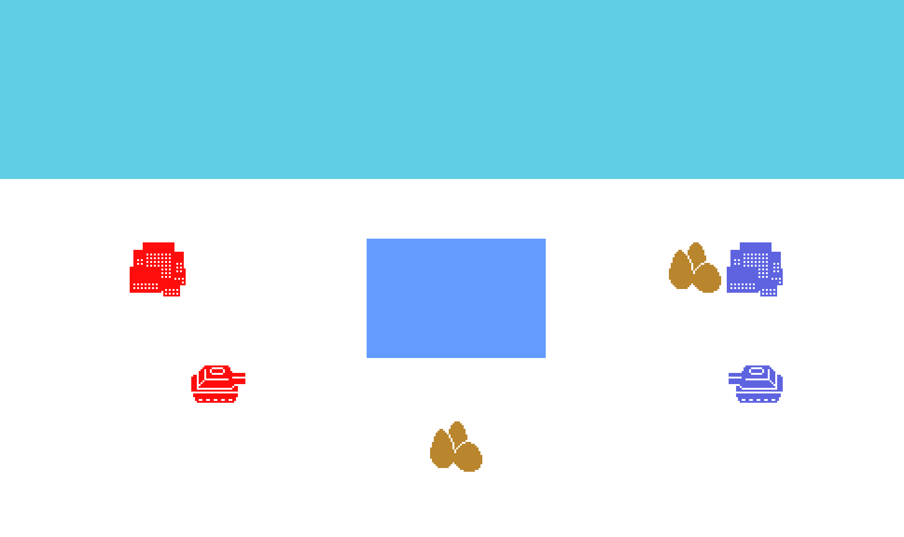

This is going to be my first devlog. Here I will document the work made for Toywars. A small tactics game.

<!-- more -->

I always have liked a lot aesthetics of tactics games. And also liked games with simple rules that interact in interesting ways. Namely games that are easy to learn, but hard to master.

I have been thinking about this game for quite some time now, and have made some attempts to make it real. But it hasn't happened yet. That is the reason I decided to write this devlog and document the process from an idea to an actual game.

## Idea

Right now I'm not completely sure how the game is supposed to work. I just now that I want to make a game with cool graphics and that's easy to learn. If it ended being even a little engaging I would considered it a win.

The initial idea was to make a game where you played against another person. At the start, you would have to build your army. You would have a certain number of points and you would choose how to use them. For example, imagine you start the game with 7 points and 3 tanks. In the army building phase, you could decide to use that points to add more tanks, and/or to improve your units. For example invest 1 point in attack in one of your tanks, 2 points in hit points in another, etc...

Then in the actual game the goal would be to destroy the opponent's cities.

I think some ideas worth considering would be to make the turns simultaneous. And another interesting idea would be that you could build different armies, and at the start of each match that you decided which to use.

Well, it's easy to dream, but probably the ideas will change a lot after having an actual prototype. And the vision will be a lot clearer.

## Prototype

Thinks the prototype will have:

- Army building
- Random map generation
- Core loop
  - Movement
  - Attack
- Basic animations
- Basic sound

## Set Up

The game will be made using C++ and [raylib](https://www.raylib.com/). I was tempted to use something a little lower level like OpenGL because it really feels nice when you make everything from scratch (at least for me). But to make my life easier, and have an actual playable game at the end, I will make the game using C++ and [raylib](https://www.raylib.com/). I haven't used [raylib](https://www.raylib.com/) before so I still think it will be interesting. Additionally, I will use OpenGL for a college project so I still get to learn a little of it.

So wrapping up, for rendering, text, sound, and input [raylib](https://www.raylib.com/) will be used. And for UI I don't know yet.The game will be built on a Linux system, and a makefile will be used as a build system. The initial setup can be found in this [repo](https://github.com/amzamora/toywars/tree/6cba5dd0ba9ee4d510a1f8746284c2cf119d88d6).

----

**Note:**

I said that I will be using C++, but I am not completely sure. Maybe I will end up using just C. This way I would be forced to develop the game in a more data-oriented way.

----

## Closing up

The idea is to have a working prototype in one month, this being August 1. And from there see where we go next. I will try to write about interesting stuff that comes up in-between.

Wish me luck!
